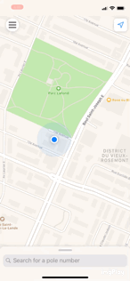
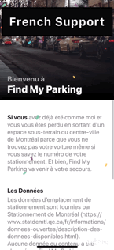
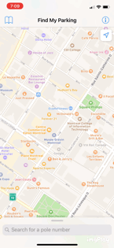

# Find My Parking

## Introduction

**Find My Parking** helps user to find parking pole location in Montreal, Canada.

Available for download at `App Store`:

## Preview

# Design

## Features

1. Created `Auto Layout` UI and animation programmatically (No Storyboard)
1. Request for user location with `CoreLocation` and shows it on `MapView` with `MapKit`
1. Search parking pole data (open-source and provided by [Stationnement de Montréal](https://www.statdemtl.qc.ca/fr/informations/donnees-ouvertes/description-des-donnees-disponibles.html)) from a `SQLite` database with [FMDB](https://github.com/ccgus/fmdb) library, and show result on MapView with `MapKit Annotations`
1. Implemented `UIView` Constraint Animation along with `UISwipeGestureRecongizer`
1. Intergrated a confetti animation with `CAEmitterLayer`
1. Customized `UICollectionView` with `UIViewPropertyAnimator` and customized `Flow Layout` to achieve a blur effect animation
1. `UITableView` with customized cell
1. Implemented `Delegation Pattern` and blocks to achieve communication between classes
1. Multiple language support: English, French and Chinese
1. Search History would be saved automatically and show on the map when selected
1. Display user current facing direction
1. Analyze user behaviour with `Google Analytics`, e.g. touch/share event
1. Customized `MKAnnotationView`
