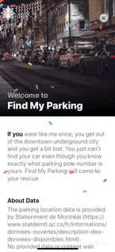
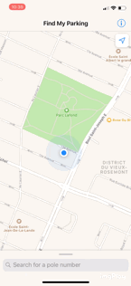
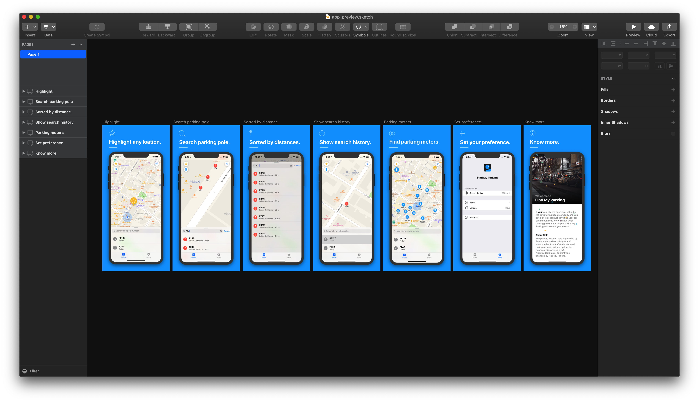

# Find My Parking

**Find My Parking** helps user to find parking pole location in Montreal, Canada.

Available for download at `App Store`:

## Preview

# Design

## Features

1. Created `Auto Layout` UI and animation programmatically (No Storyboard)
2. Request for user location with `CoreLocation` and shows it on `MapView` with `MapKit`
3. Search parking pole data (open-source and provided by [Stationnement de Montréal](https://www.statdemtl.qc.ca/fr/informations/donnees-ouvertes/description-des-donnees-disponibles.html)) from a `SQLite` database with [FMDB](https://github.com/ccgus/fmdb) library, and show result on MapView with `MapKit Annotations`
4. Read parking meters location from `.csv` file, fetched via `Core Data` then show user nearby ones
5. Implemented `UIView` Constraint Animation along with `UISwipeGestureRecongizer`
6. Intergrated a confetti animation with `CAEmitterLayer`
7. Customized `UICollectionView` with `UIViewPropertyAnimator` and customized `Flow Layout` to achieve a blur effect animation
8. `UITableView` with customized cell
9. Implemented `Delegation Pattern` and blocks to achieve communication between classes
10. Multiple language support: English, French and Chinese
11. Display user current facing direction
12. Analyze user behaviour with `Google Analytics`, e.g. touch/share event
