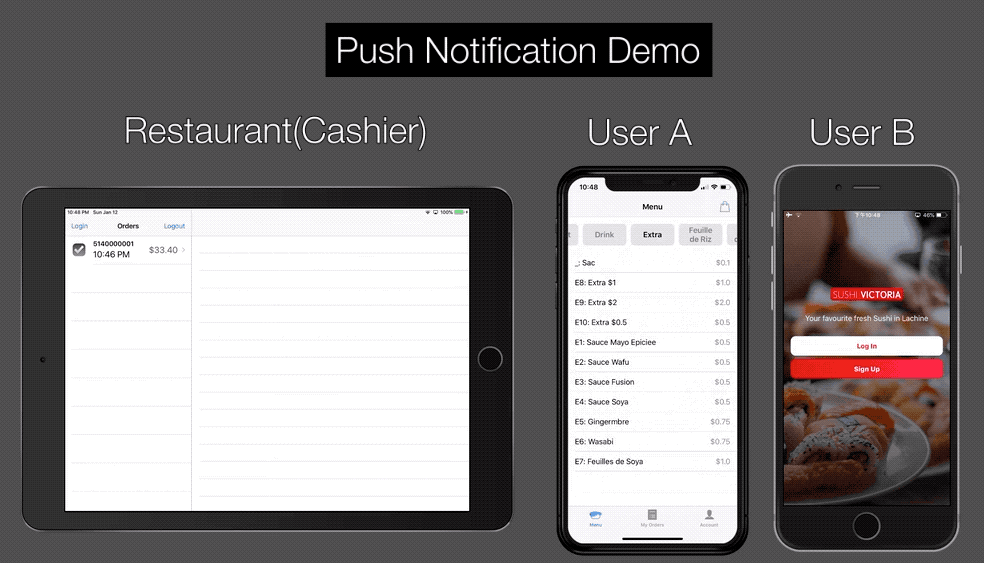

# Restaurant Mobile Order Solution

**Restaurant Mobile Order Solution** is a simplified UberEats-like app, including a client-side app and a restaurant-side app. Both sides will receive Notification when order status changes.

## Features

1. Written in `Swift` with `Auto Layout` UI programmatically
2. Integrated `Push Notification` feature via [Firebase Cloud Messaging](https://firebase.google.com/docs/cloud-messaging)
3. Deployed two [Cloud Function](https://firebase.google.com/docs/functions) to monitor data (order status) change, written in `Node.js`
4. Customized nested `UICollectionView`

## Demo

▶️ [**Video Demo**](https://vimeo.com/384440813) ⏱1 min

### Screenshots

##### iPhone (Client App) ⬇️

##### iPad (Restaurant App) ⬇️

